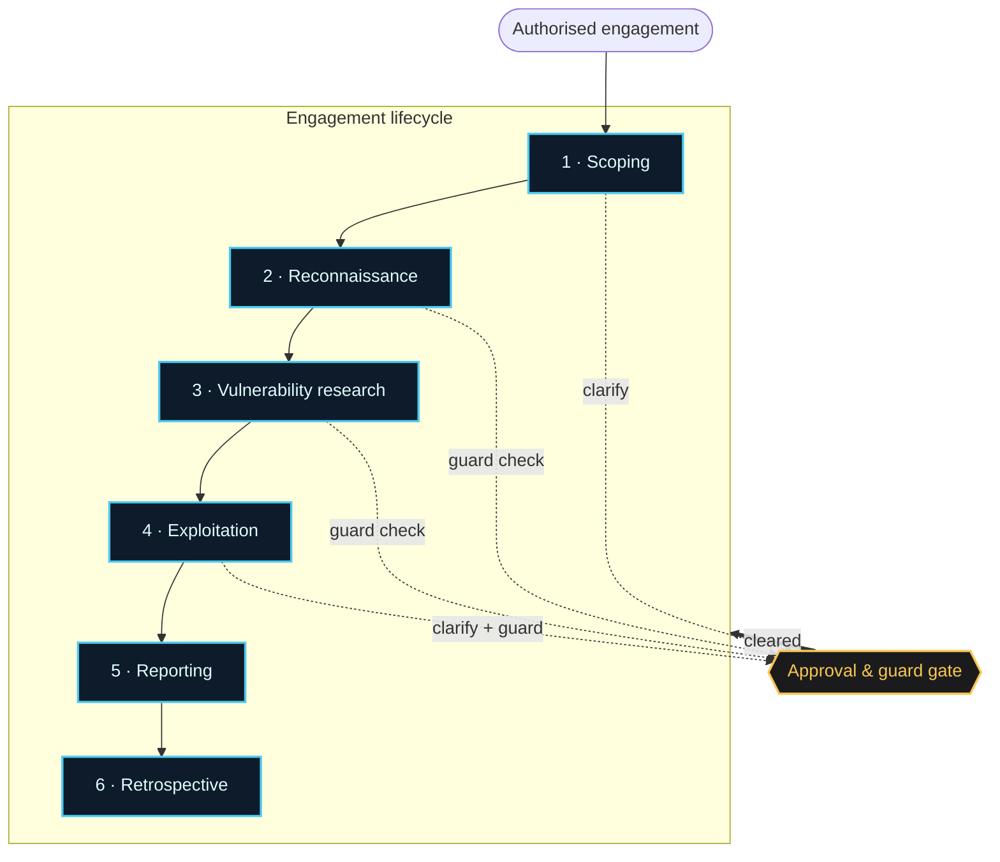
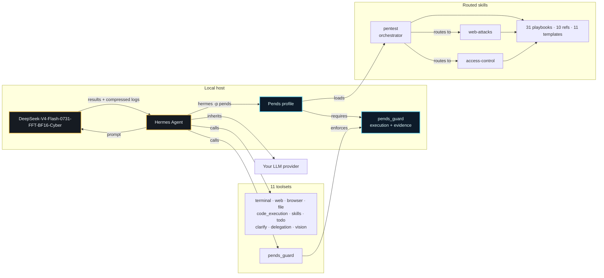
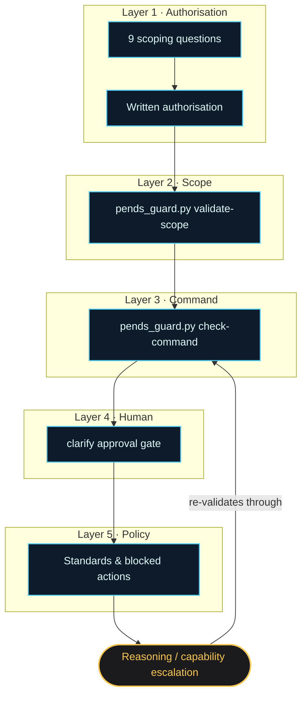

<p align="center">
  <a href="https://github.com/akonPAPA/pends/blob/master/LICENSE"></a>
  <a href="https://hermes-agent.nousresearch.com/">= 0.18.0"></a>
  <a href="https://www.kali.org/"></a>
  <a href="https://www.parrotsec.org/"></a>
  
</p>

<p align="center">
  <b>31 playbooks · 10 references · 11 templates · mandatory execution guard · built for Hermes</b>
</p>

# Pends

**Pends** is a Hermes-native profile that turns an agent into a supervised penetration tester. It runs on **DeepSeek-V4-Flash-FFT-model** and walks an authorised engagement end to end — scoping, reconnaissance, vulnerability research, careful proof-of-concept validation, and reporting. Nothing touches a target directly: every offensive command is funnelled through the mandatory `pends-guard` plugin at the execution boundary. A standalone CLI covers release checks, diagnostics, and recovery, while live target work always goes through the guard. Pends ships no credentials of its own — it borrows the provider and tool backends Hermes already has configured.

---

## Why Pends

| | |
|---|---|
| **🔬 31 methodology playbooks** | 7 operational playbooks (the five execution phases, optional post-exploitation, and a tools catalog) plus 24 vulnerability-class playbooks, routed across the `pentest`, `web-attacks`, and `access-control` skills. |
| **🛡️ Defense in depth** | Interactive scoping (9 questions) → scope validation → guard check → approval gate. A target-touching command clears all four before it ever runs. |
| **🧠 Pentesting Task Tree** | A living artifact that tracks every task with `[x] / [ ] / [~]` markers across phases, with executor-owned history, hypothesis links, and guard-bound batch reviews. |
| **🌐 Web + browser recon** | Browser toolset for approved in-scope enumeration (v3.0.0 gates the workflow but does not add a network-level allowlist); web toolset for CVE lookups, exploit search, and OSINT. |
| **📋 Evidence-first reporting** | Reproducible proof — screenshots, raw tool output, request/response pairs — with CVSS 3.1 + 4.0 crosswalks and optional remediation patches. |
| **🔗 Zero new secrets** | Inherits your existing Hermes provider, model, and tool backends. No separate credential store, no broker. |

---

## Get started

```bash
# 1. Install the profile
hermes profile install https://github.com/akonPAPA/pends

# 2. Open a session
hermes -p pends

# 3. Answer the scoping questions, then hand it a target
> Run a pentest against example.com
```

<details>
<summary><b>What you need first</b></summary>

- **Hermes Agent ≥ 0.18.0** — installed and on your PATH
- **A configured Hermes provider** — Pends reuses your existing provider/model
- **Kali Linux or Parrot OS** — the primary execution environments; a Docker Kali image is the supported fallback when the host has no pentest tooling
- **(Optional) web/browser backend** — only needed for Hermes web or browser features; Pends adds no separate API keys

</details>

<details>
<summary><b>Make it your default profile</b></summary>

```bash
hermes profile use pends
```

</details>

---

## The engagement, phase by phase

Six phases run in order; the first four report to a single approval/guard gate before anything reaches the target.



| # | Phase | What happens | Gate |
|---|-------|--------------|------|
| 1 | **Scoping** | 9 questions via `clarify` | User approval |
| 2 | **Reconnaissance** | Passive OSINT → tech fingerprinting → active scanning | Guard + approval |
| 3 | **Vulnerability research** | CVE lookup, exploit search, attack-surface mapping | Guard check |
| 4 | **Exploitation** | Safe PoC validation, one vulnerability class at a time | Guard + user approval |
| 5 | **Reporting** | Evidence compilation, CVSS scoring, remediation | — |
| 6 | **Retrospective** | Gap analysis, playbook-coverage update | Mandatory |

---

## How it fits together

Everything runs on your machine. Hermes drives the model, loads the Pends skills, and can only reach a target through the guard.



### The 11 toolsets

Configured in `config.yaml` under `platform_toolsets.cli`: ten built-ins — `terminal`, `web`, `browser`, `file`, `code_execution`, `skills`, `todo`, `clarify`, `delegation`, `vision` — plus the `pends_guard` guard-plugin toolset.

### Isolation of conversation & memory

- `memory.memory_enabled: false` — no global memory recall or write
- `memory.user_profile_enabled: false` — no global user-profile access
- Engagement state lives in project files (scope docs, evidence, reports)
- One Hermes conversation per engagement; after compression, resume it from `$ENG_DIR/state/`

---

## The safety model

Five gates stand between an idea and a packet on the wire, and capability escalation loops back through the command guard rather than around it.



- **Authorised targets only** — no probing until scoping is complete.
- **Explicit approval gates** — scope, active recon, and exploitation each need a fresh user yes.
- **Guard on every command** — target-touching work runs through `pends_exec` or another typed guard tool. `pends_exec` has no binary allowlist, so any installed non-interactive Kali/Parrot CLI can hit the explicit in-scope host while the scope, phase, PTT, hypothesis, history, evidence, timeout, and sync gates stay live. The `pre_tool_call` hook generically blocks target literals in raw `terminal` commands instead of chasing a partial tool-name list. The CLI runs the same check for diagnostics (exit `0` = allowed, `1` = blocked, `2` = review).
- **Non-destructive by default** — exploitation stops at safe, reproducible PoC.
- **Evidence or it didn't happen** — every finding carries reproducible output, screenshots, and request/response pairs.
- **No claim without proof** — a hypothesis never reaches *Validated* without a verification command.
- **Survives compression** — phase summaries and checkpoints restore the engagement without starting a new conversation.
- **A guard that explains itself** — `pends_status` (or `python scripts/pends_guard.py status --eng-dir "$ENG_DIR"`) reports the active task and phase, pending commands and their required phases, phase requirements, skill state, blockers, and the exact next actions — without running anything.
- **Phase-aware work windows** — RECON / VULN_RESEARCH allow 10 guarded commands per reviewed batch; EXPLOITATION / POST_EXPLOITATION / PRIVESC / FLAGS allow 20; the profile budget is 350 tool iterations.
- **One-call reconciliation** — `pends_review_batch` validates the finished batch, optionally writes its receipt-backed finding, updates the active PTT row once, and drops the batch lock last.

Full policy: [`skills/pentest/references/standards.md`](skills/pentest/references/standards.md). Forbidden actions: [`.hermes.md`](.hermes.md) § Forbidden Behaviour.

---

## Repository layout

```
pends/
├── .hermes.md               # Project-level agent context
├── SOUL.md                  # Agent identity — senior-pentester persona
├── config.yaml              # Profile config (toolsets, safety, memory)
├── distribution.yaml        # Hermes distribution manifest
├── plugins/pends_guard/     # Mandatory guard plugin — the execution boundary
│   ├── bash_ast.py          #   bashlex AST tokenization/parsing
│   ├── terminal_policy.py   #   AST-based blocks for target-touching raw terminal calls
│   ├── targets.py           #   scope enforcement via netaddr + yarl URL parsing
│   ├── schemas.py           #   Pydantic v2 tool schemas and validation
│   └── code_execution_audit.py  # engagement audit contract for execute_code
├── scripts/                 # CLI + release smoke helpers
│   ├── pends_guard.py       #   diagnostic/admin CLI over the plugin modules
│   ├── smoke-test.sh        #   Linux/macOS release smoke
│   ├── smoke-test.ps1       #   Windows supplemental smoke
│   └── kali.sh              #   Docker Kali helper
├── skills/
│   ├── pentest/             # Orchestrator (23 playbooks, 10 refs, 11 templates)
│   ├── web-attacks/         # 5 injection/web playbooks (SQLi, XSS, SSRF, cmdi, traversal)
│   └── access-control/      # 3 auth/authorisation playbooks (auth-bypass, IDOR, JWT)
└── tests/                   # pytest suite (see Testing below)
    ├── guard/               # guard, state, and integration coverage
    ├── pentest_docs/        # documentation-contract tests
    └── branding/            # naming-consistency regression guard
```

---

## Testing

The suite runs under `uv` with the dev dependency group. From the repo root:

```bash
uv sync --dev
uv run python -m pytest -q
```

Latest local run — **all green**:

```
305 passed in 21.83s
```

| Area | Tests | Covers |
|------|------:|--------|
| `tests/guard` | 265 | Command guard, scope/state machine, executor & adapters, integration workflows |
| `tests/pentest_docs` | 33 | Documentation-contract checks (receipts, checkpoints, CVSS crosswalk, …) |
| `tests/branding` | 6 | **New** — asserts the `pends` naming is consistent everywhere |
| `tests/test_release_links.py` | 1 | Release-note link integrity |
| **Total** | **305** | Python 3.11.9 · pytest 9.1.1 |

**`tests/branding/` (added here)** is a regression guard for the project's rename to `pends`. It fails the build if any legacy brand token creeps back into file contents or path names, if the `plugins.pends_guard` package or `scripts/pends_guard.py` CLI go missing, or if the distribution name in `pyproject.toml` drifts from `pends`:

```bash
uv run python -m pytest tests/branding -v
```

```
test_no_legacy_brand_tokens_in_contents[<legacy-string>]   PASSED
test_no_legacy_brand_tokens_in_contents[<legacy-interim>]  PASSED
test_no_legacy_brand_tokens_in_paths                       PASSED
test_pends_guard_package_importable                        PASSED
test_renamed_paths_present_and_legacy_absent               PASSED
test_pyproject_name_is_pends                               PASSED
6 passed in 0.64s
```

> The two parametrized cases scan for the legacy brand strings by name; the tokens themselves are omitted here so this README stays clean under its own check.

### Release verification

For a full pre-release gate — plugin manifest and registered tools, isolated Hermes-style plugin import, stale skill references, Ruff, and the entire pytest suite:

```bash
python scripts/pends_guard.py check-release
```

Skills load on demand and are enforced by Pends receipts. Start with `pentest`, then use `pends_record_ptt` to pick the route-required skill: the first call stages its real `skill_view` content without mutating the PTT, and repeating the same transition after the tool result returns binds it. `pends_status` reports the route, binding, context generation, recovery action, and any stale legacy marker. Target and browser activity are blocked only within the same model call as delivery or binding, then reopen on the next tool-loop continuation.

---

## Optional: Kali in Docker

<details>
<summary><b>One-time setup for a full Kali toolchain on any OS</b></summary>

The container exec helper lives in [`scripts/kali.sh`](scripts/kali.sh).

```bash
docker pull kalilinux/kali-rolling
docker create -it --name kali-pentest \
  -v /path/to/pends/engagements:/engagements \
  kalilinux/kali-rolling bash
docker start kali-pentest
docker exec kali-pentest apt update
docker exec kali-pentest apt install -y kali-linux-headless
```

</details>

---

## Contributing

See [CONTRIBUTING.md](CONTRIBUTING.md) for development setup, the PR process, and code style.

## Security

See [SECURITY.md](SECURITY.md) for how to report vulnerabilities.

## License

MIT — see [LICENSE](LICENSE).
